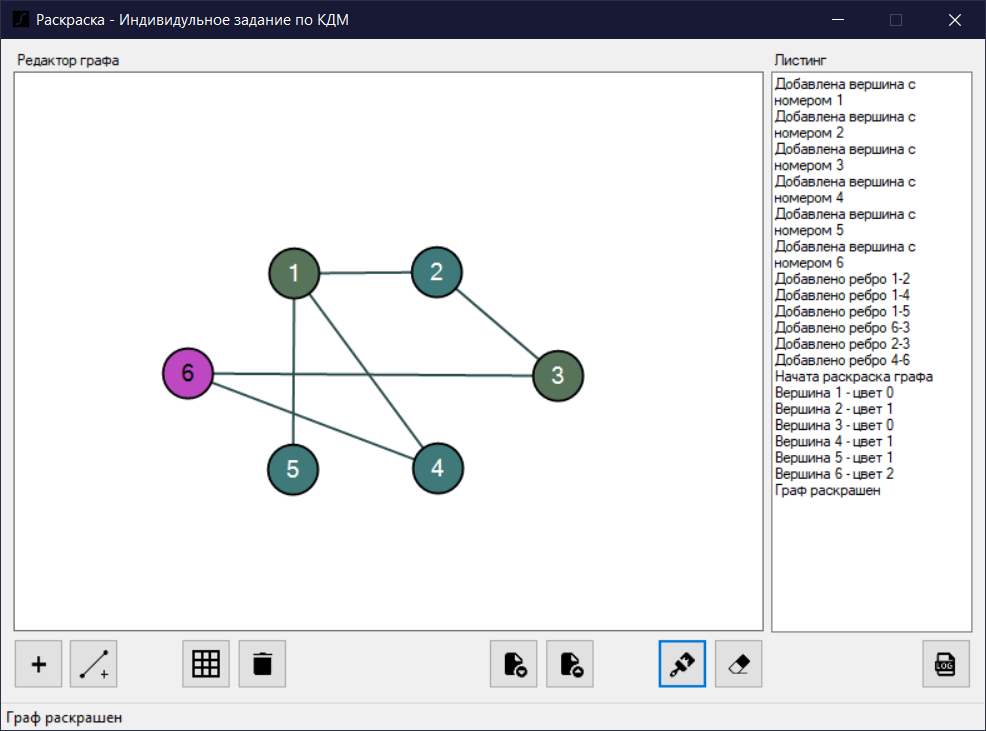

# GraphColoringEditor - редактор графов

## Введение

GraphColoringEditor - это визуальный редактор графов с базовой функциональностью, реализующий алгоритм правильной раскраски.

Он поддерживает:

- Ручное редактирование
- Редактирование матрицы смежности
- Раскраска графа на основе алгоритма правильной раскраски
- Сохранение / загрузку в файл
- Ведение подробного листинга работы программы

> Данный студенческий проект был разработан в качестве индивидуального задания по дисциплине "Компьютерная дискретная математика".

## Горячие клавиши

- _A_ - добавить вершину
- _E_ - добавить ребро
- _Delete_ - удалить вершину
- Клавиши стрелок - перемещение выделенной вершины
- Удерживание _Shift_ + клик - соединение вершин ребром
- Двойной клик в пустой области - добавить вершину

## Сборка

Для сборки проекта потребуется .NET Framework v4.7.2
Файл проекта Visual Studio 2019 представлен в репозитории

## Поддержка

Проект не будет далее поддерживаться, за исключением, возможно небольших исправлений в текущем поведении. Продукт был разработан с целью удовлетворения условиям выданного индивидуального задания. Код открыт для изменений и доработок.

Выявленные недостатки:

- Неоптимизированная работа с большим количеством вершин по причине обработки всех добавленных вершин при каждом перемещении курсора;
- Проблемы при определении выбранной вершины при их наложении друг на друга;
- Невозможность создания и удаления вершин с помощью редактирования матрицы смежности;
- Невозможность изменения меток вершин.
